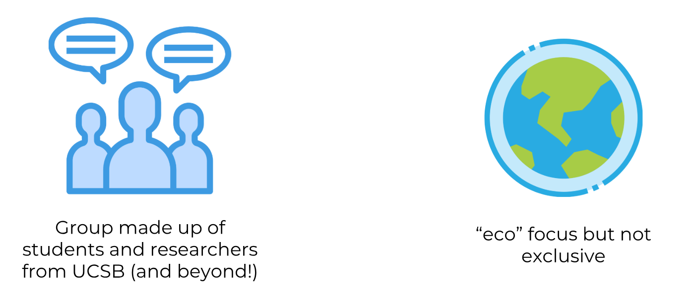
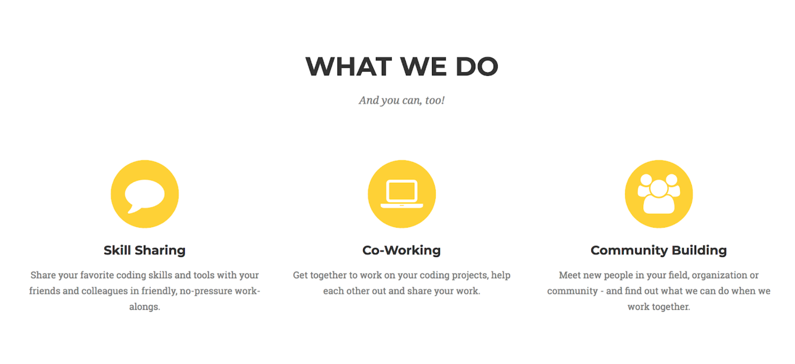
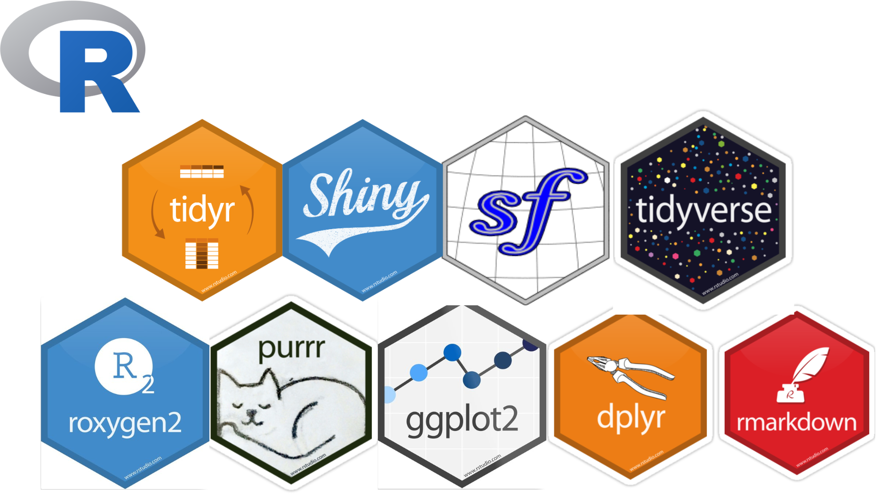
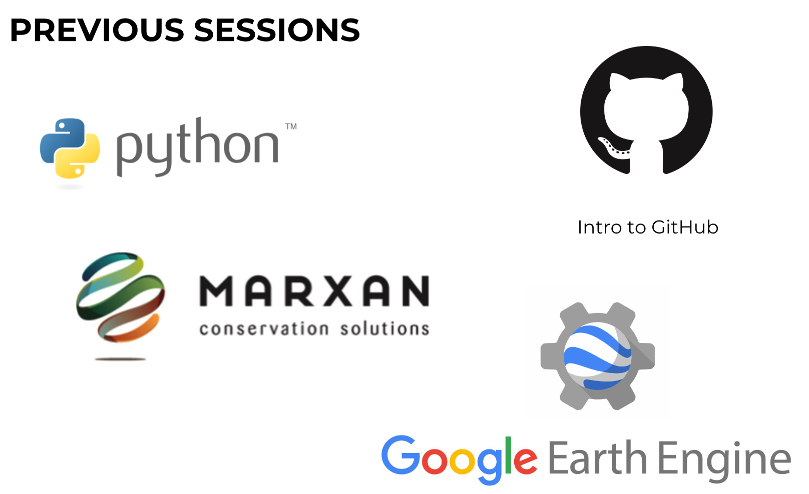
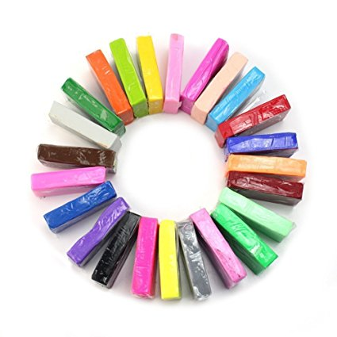

```{r setup, include=FALSE}
options(htmltools.dir.version = FALSE)
```

# Inspiration

```{r out.width='100%', fig.height=6, eval=require('leaflet'), echo = FALSE}
library(leaflet)
leaflet() %>% 
    addTiles() %>% 
    setView(-119.848947, 34.4139629, zoom = 5) %>% 
    addMarkers(-119.848947, 34.4139629)

```

---

# EcoDataScience at UC Santa Barbara



---



---



---

---

# EcoDataSci TLV

.pull-left[

]

.pull-right[
What do you want get out of the group?

What can you contribute?
]


---

# Topics

.pull-left[
- **data wrangling** with the tidyverse (tidyr, dplyr)
- data **visualization** (ggplot2)
- regular expressions, **text** analysis (stringr, tidytext)
- **iteration** (purrr)
- version control & collaboration (**git**/GitHub)
- **RMarkdown** & friends (bookdown, blogdown, etc.)
- **data management** best practices
]

.pull-right[
- working with **Excel** in R
- **vegan**/statistical packages
- **spatial** analysis (sf, raster, Python)
- **Shiny** web applications
- working with & creating **web APIs**
- **R packages**
- **parallel computing**, supercomputing
]

---

# Logistics

- 1 meeting every 2 (or 3?) weeks
- 1-2 hour meeting
- virtual participants
